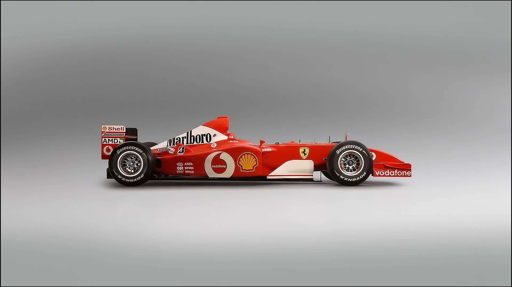

# 🏎️ Scuderia Ferrari F2004 — Interactive 3D Deconstruction Showcase

An ultra-responsive, cinematic web experience deconstructing Michael Schumacher's championship-winning **Scuderia Ferrari F2004** Formula 1 monoposto using scroll-bound canvas sequence animation, luxury motorsport UI/UX, and synthesized V10 telemetry audio.



---

## ⚡ Highlights

- **283 Ultra-HD Deconstruction Frames**: Precision exploded-view sequence detailing chassis, suspension, Tipo 053 V10 engine, and carbon aerodynamics.
- **Buttery-Smooth Inertial Scrubbing**: Custom frame-rate-independent exponential damping (`1 - exp(-12 * dt)`) eliminating wheel jank on 60Hz, 120Hz, and 144Hz displays.
- **Zero-Dependency Architecture**: Pure Vanilla HTML5 Canvas, modern CSS, and JavaScript. Zero external frameworks, zero bloat.
- **Web Audio API V10 Engine Synthesizer**: Built-in harmonic oscillator and biquad filter sweeps simulating the iconic 19,000 RPM naturally aspirated F1 V10 roar without external audio files.
- **F1 Telemetry HUD & Design System**: Styled according to official Scuderia Ferrari Corse aesthetics using **Syncopate**, **Space Mono**, and **Inter** typography with live deconstruction percentages and specs.

---

## 🛠️ Architecture & Tech Stack

| Layer | Implementation |
|---|---|
| **Rendering Engine** | HTML5 2D Canvas with Retina High-DPI scaling & aspect-ratio contain fitting |
| **Animation Loop** | `requestAnimationFrame` with delta-time exponential lerp interpolation |
| **Asset Pipeline** | Concurrent background frame preloading with nearest-neighbor cache fallback |
| **Audio Synthesis** | Web Audio API dual oscillator (`sawtooth` + `square`) & low-pass filter sweep |
| **Design System** | Luxury Motorsport Dark Mode (`#0A0B0E`, `#EF1A2D`, `#FFE600`) |

---

## 🚀 Quick Start

Serve the project with any local HTTP server:

### Option 1: PHP Built-in Server
```bash
php -S localhost:8000
```

### Option 2: Python
```bash
python -m http.server 8000
```

### Option 3: Node.js (npx)
```bash
npx serve .
```

Open [http://localhost:8000](http://localhost:8000) in your browser.

---

## 📊 Technical Specs — Ferrari F2004

- **Engine**: Ferrari Tipo 053 90° Naturally Aspirated V10 (2,997 cc)
- **Power Output**: 920 BHP @ 19,000 RPM
- **Transmission**: 7-Speed Longitudinal Semi-Automatic Sequential
- **Weight**: 605 kg (with water, oil, and driver)
- **Top Speed**: 352 km/h (218.7 mph) @ Autodromo Nazionale Monza
- **Chassis**: Carbon-fiber and honeycomb composite monocoque
- **Season Record**: 15 Wins in 18 Grands Prix (2004 Formula 1 World Champions)

---

## 📜 License

MIT License. Educational and demonstration showcase of the legendary Ferrari F2004.
